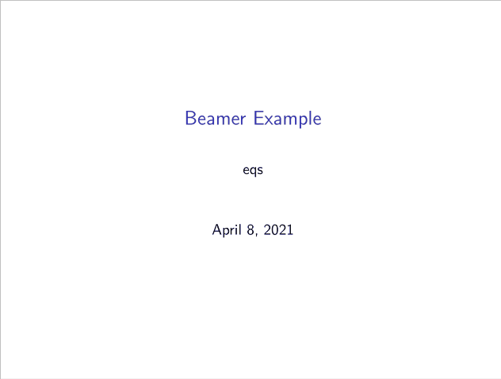

# Beamer Template

<div align="center">
    
</div>

<p align="center">
    <a href="https://speakerdeck.com/eqs/beamer-example">https://speakerdeck.com/eqs/beamer-example</a>
</p>

## Usage

### Local

1. Clone this repo
1. Run following command:

```
latexmk -r latexmkrc main.tex
```
